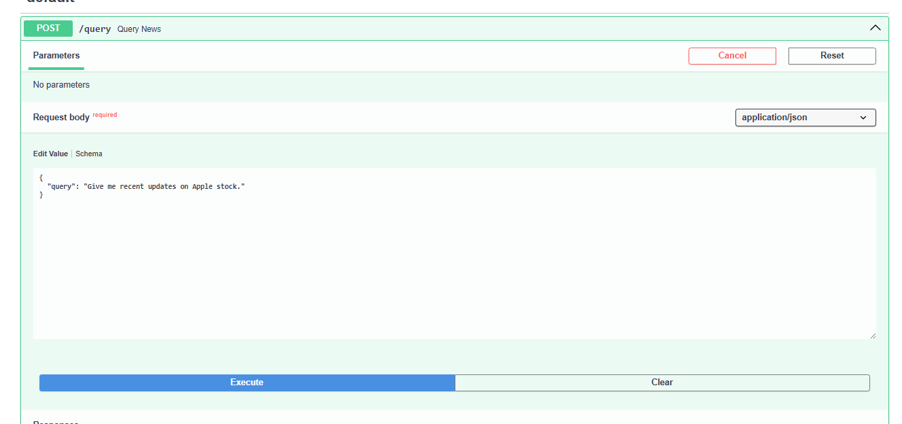
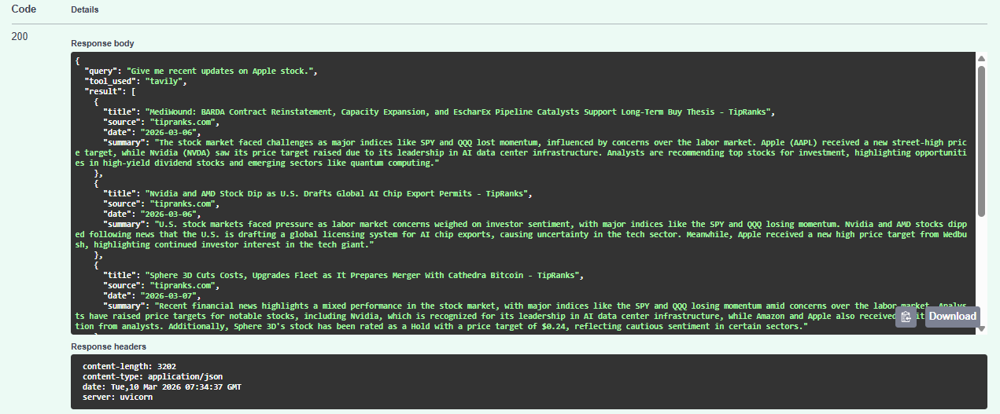

# Stock-News-Agent

A simple AI agent backend that routes natural language queries about US-listed companies to a browsing tool and returns recent news.

## Tech Stack

- FastAPI
- LangGraph
- OpenAI LLM
- Tavily Search API
- SerpAPI GoogleSearch
- Docker

## Features

1. Accepts natural language queries about companies or ticker symbols
2. Uses an LLM to identify the referenced company or ticker
3. Routes the query to a search tool
4. Summarizes the retrieved news content using an LLM, with summaries focused on the identified company
5. Returns structured, recent news results in JSON format

## Pipeline
```
User Query
   │
   ▼
FastAPI Endpoint
   │
   ▼
LangGraph Agent
   │
   ├─ Extract Company + Ticker (LLM)
   │
   ├─ Tool Selection (LLM reasoning)
   │
   └─ Conditional Router
   │      ├── Tavily
   │      └── SerpAPI
   │
   ▼
Structured JSON Response
```

## Run with Docker
1. Clone the repository

```
git clone https://github.com/nabilahannania/Stock-News-Agent.git
cd Stock-News-Agent
```

2. Create the environment file

```
cp .env.example .env
```

3. Add required API keys to .env

4. Build the Docker containers

```
docker compose build
```

5. Start the application

```
docker compose up
```

6. Open the API documentation

```
http://localhost:8000/stock-news/documentation
```

## To Use
Open the API documentation:

```
http://localhost:8000/stock-news/documentation
```

Or send a request with curl:

```
curl -X POST "http://localhost:8000/query" \
-H "Content-Type: application/json" \
-d '{"query":"What is the latest news on Nvidia?"}'
```

## API Endpoint
POST /query

Request:
```
{
  "query": "What happened with Tesla this week?"
}
```

Example response:
```
{
  "query": "What happened with Tesla this week?",
  "tool_used": "tavily",
  "result": [
    {
      "title": "Tesla Stock Rises After Buy Upgrade. Why There’s Hope Its 2026 Slump Will Reverse. - Barron's",
      "source": "barrons.com",
      "date": "2026-03-04",
      "summary": "Tesla stock experienced a rise following an upgrade from Bank of America. Despite being down approximately 13% year-to-date, the stock has gained 44% over the past year, leading to optimism about a potential reversal of its slump by 2026."
    },
    {
      "title": "Nvidia Stock Is Rising Again after a 2% Gain on Wednesday — What’s Driving the Rally? - TipRanks",
      "source": "tipranks.com",
      "date": "2026-03-05",
      "summary": "Tesla, Inc. (TSLA) experienced a decline in its stock price as recent sales data from the UK highlighted a slow and inconsistent recovery in the European market. This downturn raises concerns about the company's performance in a key region."
    },
    {
      "title": "Personio Emphasizes AI as Workforce Enabler, Not Replacement - TipRanks",
      "source": "tipranks.com",
      "date": "2026-03-05",
      "summary": "Tesla's stock (TSLA) has experienced a decline as sales figures in the UK reveal a slow and uneven recovery in the European market. This downturn highlights challenges the company faces in regaining momentum in that region."
    },
    {
      "title": "Multiverse Computing Emphasizes Diversity and Inclusion in Technology Workforce - TipRanks",
      "source": "tipranks.com",
      "date": "2026-03-08",
      "summary": "Tesla, Inc. (TSLA) experienced a decline in its stock price despite announcing ambitious plans for battery technology. The news highlights the company's ongoing efforts to innovate in the electric vehicle sector, but market reactions have not been favorable."
    },
    {
      "title": "Workforce Inclusion Highlighted at XDLINX Space Labs - TipRanks",
      "source": "tipranks.com",
      "date": "2026-03-08",
      "summary": "Tesla, Inc. (TSLA) experienced a decline in its stock price despite unveiling ambitious plans for battery technology. The market reaction suggests that investors may be skeptical about the company's ability to execute these plans effectively."
    }
  ]
}
```

## Screenshot Sample input/output




